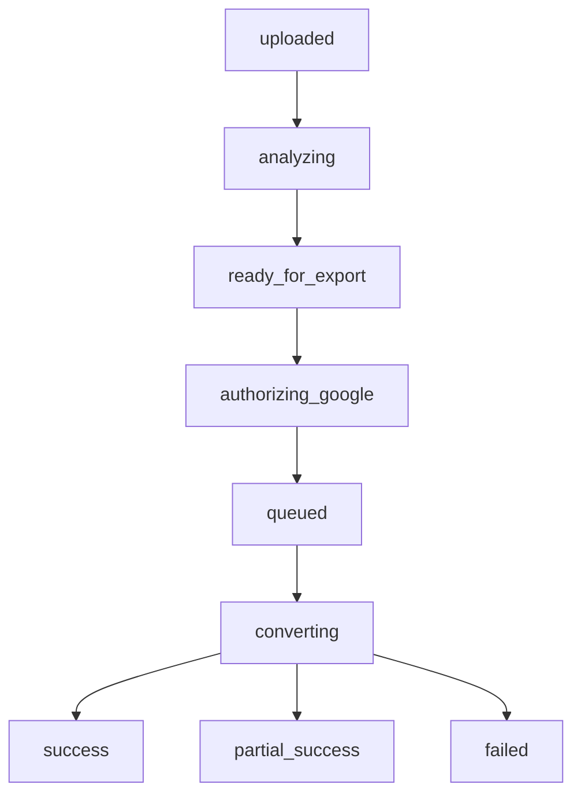

# 변환 파이프라인 설계

## 목표
업로드 이후 과정을 `동기 미리보기`와 `비동기 Google Sheets 생성`으로 분리해, 사용자는 빠르게 위험 요소를 확인하고 서버는 안정적으로 변환 작업을 처리할 수 있게 한다.

## 전체 단계
1. 파일 업로드
2. 워크북 구조 분석
3. 미리보기 JSON 생성
4. 호환성 리포트 초안 생성
5. 사용자 확인
6. Google 권한 확인
7. 변환 작업 큐 등록
8. Google Sheets 생성
9. 시트/셀/서식 반영
10. 결과 리포트 저장

## 동기 처리와 비동기 처리

### 동기 처리
업로드 직후 `즉시 응답`이 필요한 작업이다.

- 파일 검증
- 스토리지 저장
- 기본 메타 추출
- 시트 목록 파악
- 고위험 요소 감지
- 미리보기용 경량 JSON 생성

### 비동기 처리
시간이 오래 걸리거나 외부 API quota 영향을 받는 작업이다.

- Google token 검증
- 스프레드시트 생성
- 대량 셀 쓰기
- 서식 일괄 반영
- 이미지/차트 재구성 시도
- 최종 리포트 계산

## 워커 책임 분리

### Upload API
- 파일 크기, 확장자, MIME 검증
- 원본 파일 저장
- `conversion_jobs` 생성
- `uploaded` 상태 반환

### Analyzer
- 워크북 메타 구조 분석
- 수식, 병합, 서식, 숨김 시트, 객체 존재 여부 감지
- 시트별 호환성 점수 계산
- `preview_json`과 `report_json` 초안 저장
- `ready_for_export` 상태로 전환

### Conversion Worker
- Google 연결 상태 확인
- 대상 스프레드시트 생성
- 시트별 데이터 쓰기
- 서식 배치 요청 전송
- 실패 항목 누적
- 최종 상태 계산

### Report Builder
- 보존 항목 / 부분 손실 / 실패 항목 분류
- 사용자 액션 가이드 작성
- 시트별 상세 로그 저장

## 시트 단위 처리 전략
- 워크북은 `시트 단위`로 처리한다.
- 한 시트 실패가 전체 잡을 즉시 실패시키지 않는다.
- 결과 스프레드시트는 가능한 한 생성하고, 실패 시트는 리포트에 누적한다.
- 치명적 오류는 아래 경우에만 전체 실패로 본다.
  - Google 파일 생성 실패
  - 인증 토큰 무효
  - 원본 파일 파싱 불가

## 상태 전이

## Google Sheets 생성 전략

### 생성 순서
1. Drive 또는 Sheets API로 빈 스프레드시트 생성
2. 시트 제목/순서 적용
3. 셀 값 일괄 입력
4. 병합/행열 크기 적용
5. 색상/폰트/정렬/테두리 적용
6. 필터/고정행/숨김 등 부가 속성 적용
7. 이미지/차트/조건부 서식의 부분 복원 시도
8. 결과 URL 저장

### 성능 원칙
- 셀 단건 요청 대신 `batchUpdate` 우선 사용
- 시트별 요청을 묶어서 전송
- 동일 스타일은 스타일 맵으로 재사용
- 큰 파일은 구간별 분할 전송

## 리포트 생성 규칙
- 각 감지 항목은 `preserved`, `partial`, `unsupported`, `failed` 중 하나로 분류
- 리포트는 `워크북 요약`과 `시트별 상세`로 나눈다
- 사용자가 실제로 조치할 수 있는 문장으로 끝낸다

## 재시도 정책
- 네트워크/쿼터 오류는 지수 백오프로 최대 `3회` 재시도
- 파싱 오류와 함수 비호환은 즉시 리포트화
- 사용자가 `다시 시도`를 누르면 새 job을 만들지 않고 동일 원본 기준 새 변환 버전을 생성할 수 있다

## 저장 산출물
- 원본 파일
- preview JSON
- compatibility report JSON
- Google 결과 URL
- 작업 로그
- 시트별 처리 통계

## 장애 대응
- Google API quota 초과:
  - `queued` 상태 유지
  - 예상 대기시간 표시
- 일부 시트 실패:
  - 최종 상태 `partial_success`
  - 실패 시트만 목록화
- 업로드는 성공했지만 분석 실패:
  - `failed`
  - 사용자에게 재업로드 또는 파일 검사 안내
